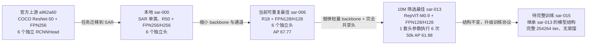
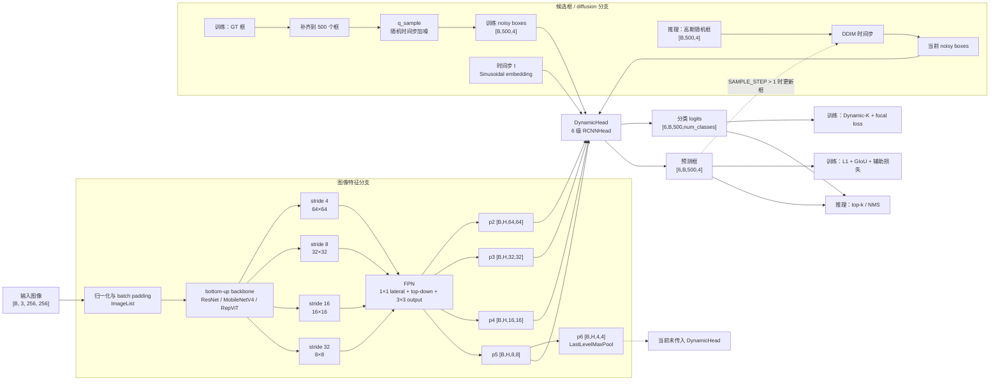
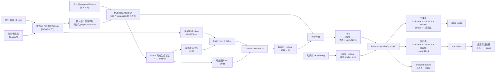
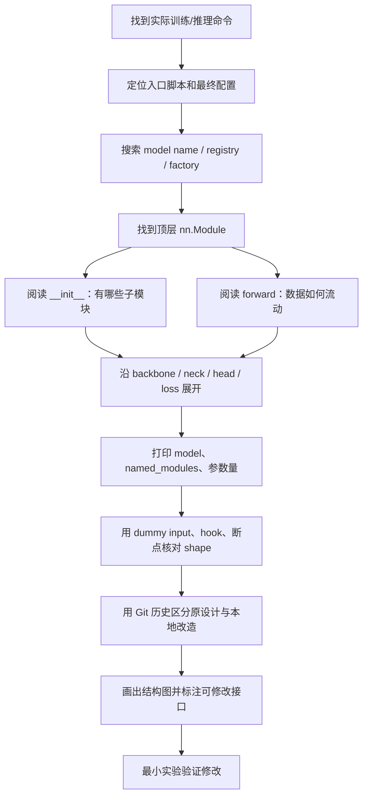

# DiffusionDet 网络结构与代码阅读指南

> 面向读者：已经学过卷积网络、Transformer、目标检测和扩散模型的基本理论，刚开始阅读真实工程代码的学习者。
>
> 核对基准：当前仓库 `main` 分支的 `408def0`，实验状态以 `docs/实验日志.md` 为准。

## 0. 建议怎样阅读本文

如果是第一次接触这个项目，建议按下面的顺序阅读：

1. 先看第 1 节，建立整网的总体印象。
2. 再看第 4～7 节，分别理解 backbone/FPN、六级动态头和 diffusion。
3. 打开代码，跟着第 9 节实际执行只读命令。
4. 准备修改网络时，再使用第 10～12 节的定位方法和检查清单。

阅读时始终记住一句话：

> DiffusionDet 不是“用扩散模型生成图像”，而是先用 backbone 和 FPN 提取图像特征，再把一组带噪边界框作为 query，通过级联动态检测头逐步恢复成目标框。

## 1. 先回答最核心的问题

这个项目的完整检测网络可以概括为：

```text
图像
  → backbone（ResNet / MobileNetV4 / RepViT）
  → FPN 多尺度图像特征 p2～p6
  → 取 p2～p5
  → 带噪候选框 + diffusion 时间步
  → 六级 DynamicHead / RCNNHead
  → 分类分数 + 目标框
```

所以，“这是一个特征提取网络 + FPN 吗？”的答案是：

- 是，但那只是图像特征提取部分。
- FPN 后面没有采用普通 Faster R-CNN 的 RPN + 标准 `ROIHeads`。
- DiffusionDet 用扩散得到的候选框代替传统 RPN proposals，并用六级动态检测头反复细化这些框。
- diffusion 主要存在于候选框坐标的加噪、时间步编码和 DDIM 反向采样中，不在 backbone 或 FPN 里面。

这里最容易混淆的三个数字是：

- `p2～p6`：5 个 FPN 输出尺度，不是 6 个检测头。
- `NUM_HEADS=6`：6 个级联框细化 stage，不是 6 个注意力头，也不是 6 层卷积。
- `NHEADS=8`：每个 `RCNNHead` 内部 `MultiheadAttention` 的 8 个注意力头。

## 2. 术语表

| 术语 | 在本项目中的含义 | 不要误解为 |
| --- | --- | --- |
| backbone / bottom-up | 从图像中抽取 `stride=4/8/16/32` 四级特征的网络 | 整个检测器 |
| FPN | 融合四级 backbone 特征并统一通道数，生成 `p2～p6` | 完整检测头 |
| proposal / query | 一个候选边界框；当前 SAR 配置每张图有 500 个 | RPN 必然生成的 anchor |
| diffusion state | 归一化并映射到扩散空间中的框坐标 `[cx, cy, w, h]` | 图像 latent 或特征图 latent |
| diffusion step | DDIM 反向采样的一次时间步更新，由 `SAMPLE_STEP` 控制 | 动态头 stage |
| DynamicHead | 管理多个级联 `RCNNHead`、RoI pooler 和时间编码的模块 | Detectron2 标准 `ROIHeads` |
| head stage | 对全部候选框执行一次 RoIAlign、交互和分类/回归，然后把框交给下一级 | 一层 `Linear` 或 `Conv2d` |
| DynamicConv | 用 proposal feature 动态生成两组矩阵，与 RoI feature 做 `bmm` | 固定权重的普通二维卷积 |
| head sharing | 多个 stage 是否复用同一套 `RCNNHead` 参数 | 减少 stage 的实际执行次数 |
| deep supervision | 对前 5 个中间 stage 也计算辅助损失 | 额外增加 5 套推理网络 |

## 3. 从官方版本到当前实验的结构演进

### 3.1 一张图看演进



这条演进线没有推翻 DiffusionDet 的基本范式。主要变化集中在：

- backbone 从 ResNet-50 逐步换成 ResNet-18、MobileNetV4 和 RepViT；
- FPN 与动态头隐藏宽度从 256 降到 128 或 64；
- 六级动态头从六套独立参数变成一套参数重复使用六次；
- diffusion 的采样、box renewal、ensemble 和蒸馏行为变得可配置。

### 3.2 代表实验对比

| 阶段 | backbone | FPN / hidden | 动态头 | 参数与结果 | 状态 |
| --- | --- | ---: | --- | --- | --- |
| 官方上游 | ResNet-50 | 256 / 256 | 6 套独立头 | COCO 配置使用 500 proposals | 上游原始设计 |
| `sar-000` | ResNet-50 | 256 / 256 | 6 套独立头 | 当前代码按 `model.parameters()` 构建为 110.55M；历史统计口径为 110.67M，AP 64.53 | 历史只读 |
| `sar-006` | ResNet-18 | 128 / 128 | 6 套独立头 | 34.46M，最佳 AP 67.77 | 当前最高可重复 SAR 基线 |
| `sar-013` | RepViT-M0.9 | 128 / 128 | 1 套参数执行 6 次 | 9.44M，50k AP 61.98 | 10M 以下 screening 最佳 |
| `sar-015` | RepViT-M0.9 | 128 / 128 | 1 套参数执行 6 次 | 9.44M，尚无完整训练 AP | 待运行正式配置 |

`sar-013` 与 `sar-015` 的模型结构相同，区别主要是实验身份和训练长度：`sar-013` 是 50k screening，`sar-015` 是准备执行 254,264 iter 的正式配置。因此不能把 `sar-013` 的 AP 直接写成 `sar-015` 的正式结果。

### 3.3 Git 历史告诉了我们什么

| 提交 | 结构相关变化 |
| --- | --- |
| `a962a60`，2022-11-18 | 官方 DiffusionDet 初始实现：box diffusion、FPN、六级独立动态头 |
| `423d357`，2022-11-18 | 上游补充前向加噪 `q_sample`，修复初始发布问题 |
| `272b1a2`，2026-02-28 | 本地引入 Detectron2 源码、SAR 配置和自定义 MobileNetV4 backbone/FPN 构建器 |
| `f847bbc`，2026-07-23 | 规范化历史实验和配置，形成 `sar-000` 等可追踪实验身份 |
| `a2f4236`，2026-08-05 | 固定 256 的可重复基线归档为 `sar-006` |
| `408def0`，2026-08-31 | 新增 `timm` backbone、动态头共享、采样开关、阶段评估和查询一致蒸馏 |

一个很重要的阅读结论是：`diffusiondet/detector.py` 和 `diffusiondet/head.py` 的核心骨架来自上游；当前本地分支主要是在接口保持不变的前提下，扩展 backbone、头共享和实验能力。

## 4. 完整网络结构与代码入口

### 4.1 整体数据流

下面以固定 256×256 输入、`HIDDEN_DIM=128`、500 proposals 为例。`B` 表示 batch size，图中空间尺寸是没有额外 padding 时的示意值。



### 4.2 从训练入口到整网类

调用链如下：

1. [`train_net.py`](../train_net.py#L29-L41) 导入 `diffusiondet`，使 `DiffusionDet` 和各 backbone 构建器完成注册。
2. `setup` 先调用 `add_diffusiondet_config`、`add_mobilenetv4_config`、`add_model_ema_configs`，再合并实验 YAML。
3. [`Trainer.build_model`](../train_net.py#L113-L127) 调用 Detectron2 的 `build_model(cfg)`。
4. [`detectron2/modeling/meta_arch/build.py`](../detectron2/modeling/meta_arch/build.py#L16-L25) 读取 `MODEL.META_ARCHITECTURE`。
5. 配置值为 `DiffusionDet`，注册表因此实例化 [`DiffusionDet`](../diffusiondet/detector.py#L67-L206)。
6. `DiffusionDet.__init__` 再根据 `MODEL.BACKBONE.NAME` 调用 [`build_backbone`](../detectron2/modeling/backbone/build.py#L20-L33)。

这说明一个通用事实：只搜索 `train_net.py` 往往看不到真正的网络，因为训练入口通过配置和注册表间接选择模型。

## 5. Backbone 和 FPN 到底做了什么

### 5.1 Backbone 的统一接口

本项目允许多种 bottom-up 网络，但要求它们向 FPN 提供四个连续尺度：

| 配置 | 四级输出名称 | 通道数 | stride |
| --- | --- | --- | --- |
| `sar-000` R50 | `res2/res3/res4/res5` | 256/512/1024/2048 | 4/8/16/32 |
| `sar-006` R18 | `res2/res3/res4/res5` | 64/128/256/512 | 4/8/16/32 |
| `sar-015` RepViT-M0.9 | `stage1/stage2/stage3/stage4` | 48/96/192/384 | 4/8/16/32 |

ResNet 的构建路径位于 [`detectron2/modeling/backbone/resnet.py`](../detectron2/modeling/backbone/resnet.py)，`timm` 模型的适配器位于 [`diffusiondet/timm_backbone.py`](../diffusiondet/timm_backbone.py#L15-L79)。

`TimmBackbone` 的工作不是重新实现 RepViT，而是：

1. 调用 `timm.create_model(..., features_only=True)`；
2. 选出四级中间特征；
3. 检查 reductions 必须正好是 `(4, 8, 16, 32)`；
4. 把 list 输出改造成 Detectron2 认识的命名字典。

### 5.2 FPN 的 1×1 和 3×3 卷积

FPN 位于 [`detectron2/modeling/backbone/fpn.py`](../detectron2/modeling/backbone/fpn.py#L17-L169)。对每一级 backbone 特征，它创建：

- 一个 `1×1 Conv`：把不同输入通道统一成 `FPN.OUT_CHANNELS`；
- 一个 `3×3 Conv`：在自顶向下融合后生成最终金字塔特征。

以 R18/FPN128 为例：

```text
res5: 512 通道 --1×1--> 128 --------------------------> 3×3 --> p5
                                      ↑ 上采样
res4: 256 通道 --1×1--> 128 --逐元素相加-------------> 3×3 --> p4
                                      ↑ 上采样
res3: 128 通道 --1×1--> 128 --逐元素相加-------------> 3×3 --> p3
                                      ↑ 上采样
res2:  64 通道 --1×1--> 128 --逐元素相加-------------> 3×3 --> p2

p5 --stride=2 max pool--> p6
```

构建函数 [`build_resnet_fpn_backbone`](../detectron2/modeling/backbone/fpn.py#L217-L236) 和 [`build_timm_fpn_backbone`](../diffusiondet/timm_backbone.py#L69-L79) 都传入 `LastLevelMaxPool()`，所以两条路径都会得到 `p2～p6`。

### 5.3 为什么有 p6，却只使用 p2～p5

`FPN.forward` 返回 `p2～p6`，但 [`DiffusionDet.forward`](../diffusiondet/detector.py#L459-L530) 会按照：

```yaml
MODEL:
  ROI_HEADS:
    IN_FEATURES: ["p2", "p3", "p4", "p5"]
```

重新取出特征。因此当前普通检测路径中：

- `p2～p5` 被送给 RoIAlign；
- `p6` 被构建并返回，但没有送进 `DynamicHead`；
- `p6` 的 max-pool 本身没有可学习参数；
- 若以后想使用 `p6`，不能只改图上的理解，必须同时检查 RoI pooler 的尺度分配和实验配置。

## 6. 六级动态检测头：不是“六层卷积”

### 6.1 六级是什么意思

[`DynamicHead.forward`](../diffusiondet/head.py#L163-L195) 中有一个长度为 `NUM_HEADS` 的循环。当前值是 6，因此数据流是：

```text
初始带噪框
  → stage 1 预测框
  → stage 2 再细化
  → stage 3 再细化
  → stage 4 再细化
  → stage 5 再细化
  → stage 6 最终框
```

每一级都接收：

- 同一组 `p2～p5` 图像特征；
- 上一级输出的候选框；
- 上一级输出的 proposal feature；
- 同一个 diffusion 时间步 embedding。

框在传给下一级前调用了 `detach()`，因此后一级不会通过框坐标反向传播回前一级；但前一级本身仍由 deep supervision 产生的辅助损失监督。

### 6.2 一个 RCNNHead 的内部结构



对应源码为：

- `DynamicHead` 和 RoI pooler：[`diffusiondet/head.py`](../diffusiondet/head.py#L71-L195)
- 单级 `RCNNHead`：[`diffusiondet/head.py`](../diffusiondet/head.py#L198-L308)
- `DynamicConv`：[`diffusiondet/head.py`](../diffusiondet/head.py#L351-L396)

### 6.3 DynamicConv 为什么名字里有 Conv

这里的“动态卷积”强调权重由当前 proposal 动态生成，不代表源码里一定出现 `nn.Conv2d`。

设隐藏维度为 `H`，动态瓶颈为 64：

1. proposal feature 经过 `dynamic_layer`，生成 `2 × H × 64` 个参数；
2. 前半部分 reshape 为 `W1: H×64`；
3. 后半部分 reshape 为 `W2: 64×H`；
4. 每个 RoI 的 49 个空间 token 先乘 `W1`，再乘 `W2`；
5. 结果 flatten 后经 `out_layer: 49H→H` 回到 proposal 隐藏维度。

矩阵是每个 proposal 自己生成的，所以不同候选框会用不同的变换抽取 RoI 特征。这就是“dynamic”的来源。

### 6.4 配置中的几种“head”和“层”

| 配置 | 当前值 | 真正含义 |
| --- | ---: | --- |
| `NUM_HEADS` | 6 | 级联框细化 stage 数 |
| `NHEADS` | 8 | 每个 stage 内部自注意力的 attention head 数 |
| `NUM_CLS` | 1 | 分类分支的 `Linear + LayerNorm + ReLU` 组数 |
| `NUM_REG` | 3 | 回归分支的 `Linear + LayerNorm + ReLU` 组数 |
| `NUM_DYNAMIC` | 2 | DynamicConv 中的两次动态矩阵变换；当前实现事实上按 2 写定 |
| `DIM_DYNAMIC` | 64 | 两次动态矩阵之间的瓶颈宽度 |
| `DIM_FEEDFORWARD` | 2048 | stage 内普通 FFN 的中间维度 |

需要特别注意：`ROI_BOX_HEAD.NUM_FC` 和 `ROI_BOX_HEAD.FC_DIM` 是 Detectron2 标准 box head 的配置。本项目没有构建标准 box head，`DynamicHead` 只读取 `ROI_BOX_HEAD` 下的 pooler 参数。因此修改这两个字段不会改变当前 DiffusionDet 的线性层。

### 6.5 独立六级头与完全共享六级头

`HEAD_SHARING` 由 [`DynamicHead.__init__`](../diffusiondet/head.py#L80-L108) 解释：

- `none`：深拷贝 6 份 `RCNNHead`，每一级有独立参数；
- `full`：只保存 1 份 `RCNNHead`，循环调用 6 次；
- `heavy`：保留 6 份头，但共享参数量较大的 `DynamicConv` 和 FFN，分类/回归等轻部分仍独立。

因此，`sar-015` 仍然有六级计算和六次框细化，只是六次使用同一套权重。共享主要减少模型大小，不会按六倍直接减少推理计算量。

### 6.6 参数量实际分布

下面的数据来自当前代码在 CPU 上构建模型后，对 `model.parameters()` 的实际统计；构建 `sar-015` 时关闭了预训练下载，参数结构和数量不受影响。

| 配置 | bottom-up | FPN | DynamicHead（含 time MLP） | 总参数 | 保存的头 / 执行 stage |
| --- | ---: | ---: | ---: | ---: | ---: |
| `sar-000` | 23,454,912 | 3,344,384 | 83,752,222 | 110,551,518 | 6 / 6 |
| `sar-006` | 11,166,912 | 713,728 | 22,582,302 | 34,462,942 | 6 / 6 |
| `sar-015` | 4,717,792 | 683,008 | 4,037,637 | 9,438,437 | 1 / 6 |

这张表也解释了为什么本项目优先研究 head sharing：在 `sar-000` 和 `sar-006` 中，动态头比 backbone 更占参数。把六套头变成一套后，模型才有空间在 10M 预算内使用表达能力更好的 RepViT backbone 和 128 维特征。

## 7. Diffusion 到底在哪里

### 7.1 扩散的是框，不是图像

本项目的扩散状态形状是：

```text
[batch_size, num_proposals, 4]
```

最后一维是归一化的 `[cx, cy, w, h]`。图像只经过 backbone/FPN 一次，不会被加高斯噪声，也没有图像扩散模型常见的 U-Net。

`DiffusionDet.__init__` 在 [`diffusiondet/detector.py`](../diffusiondet/detector.py#L98-L157) 中创建 1000 步 cosine beta schedule，并把前向扩散和后验计算所需的系数注册为 buffer。这些 buffer 没有可学习参数，但会随模型移动到 CPU/GPU 并进入 `state_dict`。

### 7.2 训练和推理两条路径

第 4.1 节的整体结构图同时画出了两条路径。它们共享 backbone、FPN 和 DynamicHead，区别主要在候选框的来源和最终去向：

| 阶段 | 候选框从哪里来 | DynamicHead 后做什么 |
| --- | --- | --- |
| 训练 | 已知 GT 框经过补齐和随机时间步加噪 | 与 GT 做 Dynamic-K matching，计算最终级和中间级损失 |
| 推理 | 不知道 GT，从 `[B,500,4]` 纯高斯噪声开始 | 单步时直接输出；多步时按 DDIM 更新框并再次调用 DynamicHead |

### 7.3 训练时怎样加噪

训练主路径位于 [`DiffusionDet.forward`](../diffusiondet/detector.py#L459-L530)：

1. 图像经过 backbone/FPN 得到 `p2～p5`。
2. [`prepare_targets`](../diffusiondet/detector.py#L602-L630) 把 GT 框从绝对 `xyxy` 转成归一化 `cxcywh`。
3. [`prepare_diffusion_concat`](../diffusiondet/detector.py#L565-L600) 在 GT 少于 `NUM_PROPOSALS` 时加入随机占位框，补到 500 个。
4. 框坐标从 `[0,1]` 映射到 `[-SNR_SCALE,SNR_SCALE]`。
5. 每张图随机抽取一个 `t∈[0,999]`，调用 [`q_sample`](../diffusiondet/detector.py#L450-L457)：

```text
x_t = sqrt(alpha_bar_t) * x_0
    + sqrt(1 - alpha_bar_t) * noise
```

6. 带噪框转回绝对 `xyxy` 后送入六级动态头。
7. 网络目标是直接预测干净框 `x0`，源码中的 `self.objective = 'pred_x0'` 正是这个含义。
8. [`diffusiondet/loss.py`](../diffusiondet/loss.py) 使用 Dynamic-K 匹配，再计算 focal、L1 和 GIoU 损失。

### 7.4 推理时怎样去噪

[`ddim_sample`](../diffusiondet/detector.py#L312-L444) 从 `randn([B,500,4])` 开始。每个 DDIM 时间步会：

1. 把当前扩散状态转换成图像绝对坐标中的候选框；
2. 调用六级动态头预测分类和干净框 `x0`；
3. 根据 `x_t` 和 `x0` 反推出噪声；
4. 用 DDIM 公式更新到下一个时间步；
5. 可选地删除低置信框，并用新随机框补回固定的 proposal 数量。

当前代表配置均使用 `SAMPLE_STEP=1`。此时 `times` 实际只有 `(999,-1)`：

- DynamicHead 被调用一次，但内部仍执行 6 个 stage；
- 直接采用这次预测的 `x0` 作为最终结果；
- 因为已经到 `-1`，DDIM 中间更新、box renewal、跨步 ensemble 和 `DDIM_ETA` 不会在这条单步路径中产生实际作用；
- 最后的 top-k 和 NMS 仍会执行。

如果改成 `SAMPLE_STEP=4`，含义是最多调用 4 次 DynamicHead，每次内部再执行 6 个 stage。它不是把 `NUM_HEADS` 从 6 改成 4。

### 7.5 时间步怎样进入检测头

时间步不是只用于 DDIM 公式。`DynamicHead` 还会把整数 `t` 送入：

```text
SinusoidalPositionEmbeddings
  → Linear(H, 4H)
  → GELU
  → Linear(4H, 4H)
```

每个 `RCNNHead` 再用 `SiLU + Linear(4H,2H)` 得到 `scale` 和 `shift`，对 proposal feature 做：

```text
feature = feature * (scale + 1) + shift
```

因此，同一个动态头可以知道当前框处在高噪声还是低噪声时间步，并据此调整分类和回归。

### 7.6 可选蒸馏在哪里

`408def0` 加入了训练期可选教师分支：

- 配置入口：`MODEL.DiffusionDet.DISTILLATION.*`；
- 教师创建和加载：[`DiffusionDet._get_distillation_teacher`](../diffusiondet/detector.py#L228-L244)；
- 蒸馏损失：[`DiffusionDet._distillation_losses`](../diffusiondet/detector.py#L246-L283)；
- 训练时教师和学生接收同一组 noisy queries，并比较最终级类别和框输出。

它不是当前部署模型的一部分：教师被延迟创建、冻结，而且不进入学生 `state_dict`。`sar-014` 使用过该分支，但 50k AP 为 60.36，低于无蒸馏学生 `sar-013` 的 61.98，因此已经淘汰。`sar-015` 明确关闭蒸馏。

## 8. 配置项到代码行为的索引

| 配置项 | 读取位置 | 控制的模块或张量 | 修改时的主要约束 |
| --- | --- | --- | --- |
| `MODEL.META_ARCHITECTURE` | Detectron2 `build_model` | 顶层整网类 | 当前必须解析到已注册的 `DiffusionDet` |
| `MODEL.BACKBONE.NAME` | Detectron2 `build_backbone` | ResNet/MobileNetV4/`timm` + FPN 构建器 | 函数必须注册并返回 `Backbone` |
| `MODEL.FPN.IN_FEATURES` | `FPN.__init__` | 输入的四级 bottom-up 特征 | stride 必须连续翻倍 |
| `MODEL.FPN.OUT_CHANNELS` | `FPN.__init__` | `p2～p6` 通道数 | 当前需与动态头隐藏维度一致 |
| `MODEL.ROI_HEADS.IN_FEATURES` | `DynamicHead._init_box_pooler`、`DiffusionDet.forward` | 实际送入 RoIAlign 的 FPN 层 | 当前为 `p2～p5` |
| `MODEL.ROI_BOX_HEAD.POOLER_RESOLUTION` | `DynamicHead`、`DynamicConv` | 每个 RoI 的空间大小 | 当前为 7，影响 `out_layer` 输入维度 `49H` |
| `MODEL.DiffusionDet.NUM_PROPOSALS` | `DiffusionDet` | 每图扩散框/query 数量 | 影响显存、注意力和 RoIAlign 计算量 |
| `MODEL.DiffusionDet.HIDDEN_DIM` | `DynamicHead`/`RCNNHead` | proposal、attention 和动态头宽度 | 当前必须匹配 FPN 输出通道 |
| `MODEL.DiffusionDet.NUM_HEADS` | `DynamicHead` | 级联细化次数 | 影响执行量；`none` 下也影响参数量 |
| `MODEL.DiffusionDet.HEAD_SHARING` | `DynamicHead.__init__` | `none/full/heavy` 参数共享方式 | 共享不等于减少执行 stage |
| `MODEL.DiffusionDet.NHEADS` | `RCNNHead` | `MultiheadAttention` 的头数 | `HIDDEN_DIM` 必须能被它整除 |
| `MODEL.DiffusionDet.NUM_CLS/NUM_REG` | `RCNNHead` | 分类/回归 Linear tower 深度 | 与 `NUM_HEADS` 无关 |
| `MODEL.DiffusionDet.SNR_SCALE` | 框准备和预测转换 | 框扩散空间范围 | 训练和推理必须一致 |
| `MODEL.DiffusionDet.SAMPLE_STEP` | `ddim_sample` | 推理 DDIM 时间步数 | 不得超过训练 schedule 的 1000 |
| `DDIM_ETA/BOX_RENEWAL/ENSEMBLE_MODE` | `ddim_sample` | 多步采样更新和跨步结果融合 | `SAMPLE_STEP=1` 时大部分不会生效 |
| `DEEP_SUPERVISION` | `DynamicHead`、criterion | 是否返回并监督中间五级输出 | 关闭后只监督最后一级 |
| `DISTILLATION.ENABLED` | `DiffusionDet.forward` | 训练期教师和额外 KD 损失 | 当前正式候选关闭 |

配置默认值定义在 [`diffusiondet/config.py`](../diffusiondet/config.py#L11-L125)，但一次实验的真实结构必须以完整配置继承链和运行目录冻结的 `config.yaml` 为准。

## 9. 在这个项目中做一次完整的代码追踪

本节的命令都是只读分析命令，不会启动正式训练。先进入正确环境：

```bash
cd /home/troy/workspace/DiffusionDet
conda activate Difdet
python -c "import torch, detectron2; print(torch.__version__, detectron2.__file__)"
```

### 第一步：从实验配置确认“到底构建哪个模型”

不要先猜类名，先看要研究的配置及其 `_BASE_`：

```bash
sed -n '1,160p' \
  configs/experiments/sar_ship/sar-015-under10m-repvit-full-seed40244023.yaml
sed -n '1,180p' configs/machine/Rtx2080ti-SAR-Under10M.yaml
sed -n '1,180p' configs/Base-DiffusionDet.yaml
```

快速找结构键：

```bash
rg -n "META_ARCHITECTURE|BACKBONE|FPN|IN_FEATURES|HIDDEN_DIM|NUM_HEADS|HEAD_SHARING|SAMPLE_STEP" \
  configs/Base-DiffusionDet.yaml \
  configs/machine/Rtx2080ti-SAR-Under10M.yaml \
  configs/experiments/sar_ship/sar-015-under10m-repvit-full-seed40244023.yaml
```

### 第二步：找注册器，而不是只找 import

```bash
rg -n "META_ARCH_REGISTRY|BACKBONE_REGISTRY|@.*register" \
  train_net.py diffusiondet detectron2/modeling
```

看到 `MODEL.META_ARCHITECTURE: "DiffusionDet"` 后，搜索：

```bash
rg -n "class DiffusionDet|META_ARCH_REGISTRY.register" diffusiondet
```

看到 `BACKBONE.NAME: "build_timm_fpn_backbone"` 后，搜索：

```bash
rg -n "def build_timm_fpn_backbone|class TimmBackbone" diffusiondet
```

### 第三步：先读 `__init__`，再读 `forward`

对顶层网络先回答两个问题：

1. `__init__` 创建了哪些子模块？
2. `forward` 按什么顺序调用这些模块，训练和推理在哪里分叉？

```bash
rg -n "class DiffusionDet|def __init__|def forward|def ddim_sample|def prepare_targets" \
  diffusiondet/detector.py
rg -n "class DynamicHead|class RCNNHead|class DynamicConv|def forward" \
  diffusiondet/head.py
```

### 第四步：实际构建模型，验证参数和接口

下面脚本不会加载权重，也不会创建实验目录。对 `timm` 配置临时关闭预训练，只是为了避免结构检查触发网络下载。

```bash
python - <<'PY'
from detectron2.config import get_cfg
from detectron2.modeling import build_model
from diffusiondet import add_diffusiondet_config, add_mobilenetv4_config
from diffusiondet.util.model_ema import add_model_ema_configs

path = "configs/experiments/sar_ship/sar-015-under10m-repvit-full-seed40244023.yaml"

cfg = get_cfg()
add_diffusiondet_config(cfg)
add_mobilenetv4_config(cfg)
add_model_ema_configs(cfg)
cfg.merge_from_file(path)
cfg.MODEL.DEVICE = "cpu"
cfg.MODEL.WEIGHTS = ""
cfg.MODEL.TIMM.PRETRAINED = False
cfg.freeze()

model = build_model(cfg)

print("top-level:", type(model).__name__)
print("bottom-up:", type(model.backbone.bottom_up).__name__)
print("fpn outputs:")
for name, shape in model.backbone.output_shape().items():
    print(f"  {name}: channels={shape.channels}, stride={shape.stride}")

print("stored heads:", len(model.head.head_series))
print("executed stages:", model.head.num_heads)
print("total params:", sum(p.numel() for p in model.parameters()))
for name, child in model.named_children():
    print(name, sum(p.numel() for p in child.parameters()))
PY
```

预期关键结果是：

```text
top-level: DiffusionDet
bottom-up: TimmBackbone
p2～p6: channels=128, stride=4/8/16/32/64
stored heads: 1
executed stages: 6
total params: 9438437
```

### 第五步：用 forward hook 看真实 shape

下面是在随机输入上观察 bottom-up、FPN 和完整动态头输出的练习。它不代表模型精度，只用于理解张量流；CPU 上执行六级动态头可能需要等待一会儿。

```bash
python - <<'PY'
import torch
from detectron2.config import get_cfg
from detectron2.modeling import build_model
from diffusiondet import add_diffusiondet_config, add_mobilenetv4_config
from diffusiondet.util.model_ema import add_model_ema_configs

def shapes(value):
    if isinstance(value, torch.Tensor):
        return list(value.shape)
    if isinstance(value, dict):
        return {key: shapes(item) for key, item in value.items()}
    if isinstance(value, (list, tuple)):
        return [shapes(item) for item in value]
    return type(value).__name__

def watch(name):
    def hook(_module, _inputs, output):
        print(name, shapes(output))
    return hook

cfg = get_cfg()
add_diffusiondet_config(cfg)
add_mobilenetv4_config(cfg)
add_model_ema_configs(cfg)
cfg.merge_from_file(
    "configs/experiments/sar_ship/sar-015-under10m-repvit-full-seed40244023.yaml"
)
cfg.MODEL.DEVICE = "cpu"
cfg.MODEL.WEIGHTS = ""
cfg.MODEL.TIMM.PRETRAINED = False
cfg.freeze()

model = build_model(cfg).eval()
handles = [
    model.backbone.bottom_up.register_forward_hook(watch("bottom-up")),
    model.backbone.register_forward_hook(watch("FPN")),
    model.head.register_forward_hook(watch("DynamicHead")),
]

image = torch.zeros(3, 256, 256)
with torch.no_grad():
    result = model([{"image": image, "height": 256, "width": 256}])
print("result type:", type(result), type(result[0]["instances"]).__name__)

for handle in handles:
    handle.remove()
PY
```

应重点观察而不是死记数值：

```text
image [3,256,256]
→ bottom-up 四级 feature
→ FPN 的 p2～p6
→ DynamicHead 的 logits [6,1,500,1]
→ DynamicHead 的 boxes  [6,1,500,4]
→ Instances
```

### 第六步：在关键边界下断点

如果使用 VS Code/PyCharm，第一次不必在每一层下断点。建议只放在这些边界：

1. `DiffusionDet.forward` 中 `images = ...` 之后：看规范化、padding 后的输入。
2. `src = self.backbone(images.tensor)` 之后：看 `p2～p6`。
3. `prepare_targets` 返回后：看 `x_boxes` 和 `t`。
4. `DynamicHead.forward` 的 stage 循环内：看框如何逐级变化。
5. `RCNNHead.forward` 的 `roi_features = pooler(...)` 之后：看 RoI 特征。
6. `outputs_class, outputs_coord` 返回后：看六级输出。
7. criterion 返回后：看主损失和 `_0～_4` 辅助损失。

一次只追一张图或极小 batch，并先关闭不相关的训练 hook，调试体验会清晰很多。

### 第七步：用 Git 判断“原本如此”还是“后来改的”

```bash
git log --follow --oneline -- diffusiondet/detector.py
git log --follow --oneline -- diffusiondet/head.py
git blame -L 67,170 diffusiondet/detector.py
git blame -L 71,195 diffusiondet/head.py
git show a962a60:diffusiondet/head.py | sed -n '70,240p'
git diff a962a60..HEAD -- diffusiondet/head.py diffusiondet/detector.py
git show --stat 408def0
```

这些命令分别回答：

- 文件经历过哪些提交；
- 某一行是谁、何时引入的；
- 上游初版当时是什么样；
- 当前版本相对上游到底改了什么；
- 某次提交还同时修改了哪些配置、测试和工具。

## 10. 怎样快速定位一个陌生深度学习项目的整体网络

下面的方法不依赖 Detectron2，可以迁移到大部分 PyTorch 项目。



### 10.1 先找“模型是怎样被选择的”

常见工程不会直接写 `model = MyNet()`，而会使用：

- YAML/JSON/TOML 配置；
- registry；
- factory 函数，如 `build_model`、`create_model`、`make_model`；
- Hydra、MMEngine、Detectron2、Lightning 等框架封装。

优先搜索：

```bash
rg -n "build_model|create_model|make_model|META_ARCHITECTURE|registry|register" .
```

### 10.2 找到顶层模块后，先画粗图

第一遍只记录大的数据流：

```text
input → preprocessing → backbone → neck → head → loss/postprocess
```

不要一开始就钻进某个 Bottleneck 的每个卷积。先弄清整网有哪些“器官”，再研究每个“器官”的内部结构。

### 10.3 同时追踪三种关系

分析网络时应同时记录：

1. **模块包含关系**：`DiffusionDet` 里面有 `backbone`、`head`、`criterion`。
2. **forward 数据关系**：图像特征和 noisy boxes 在 `DynamicHead` 汇合。
3. **配置控制关系**：`HEAD_SHARING` 决定保存几套头，`NUM_HEADS` 决定执行几次。

只看 `print(model)` 能看到模块包含关系，却看不到训练/推理分支；只看 `forward` 能看到数据流，却可能不知道具体配置实例化的是哪个类。因此三者缺一不可。

### 10.4 用 shape 作为模块之间的“接口合同”

对于每条关键边，记录：

```text
名称、shape、dtype、坐标格式、数值范围、训练/推理是否不同
```

例如本项目中：

| 边界 | 接口合同 |
| --- | --- |
| 图像 → backbone | `[B,3,H,W]`，已按 RGB mean/std 归一化并 padding |
| backbone → FPN | 四级 dict，stride 必须为 4/8/16/32 |
| FPN → DynamicHead | `p2～p5` 通道相同，当前通道等于 `HIDDEN_DIM` |
| diffusion → DynamicHead | 绝对 `xyxy` 框 `[B,500,4]` 加整数时间步 `[B]` |
| DynamicHead → loss | 六级 logits 和绝对 `xyxy` 框 |
| loss targets | 类别、归一化 `cxcywh`、绝对 `xyxy` 与图像尺寸 |

网络改进最常见的 bug，不是公式写错，而是破坏了某个接口合同。

## 11. 从哪里改网络，以及改动会影响什么

| 想研究的方向 | 首要代码位置 | 同时检查 |
| --- | --- | --- |
| 更换 backbone | `diffusiondet/timm_backbone.py` 或新增注册构建器 | 四级输出名称、通道、stride、预训练权重 |
| 改 FPN 融合 | `detectron2/modeling/backbone/fpn.py` | `OUT_CHANNELS`、`HIDDEN_DIM`、旧配置默认行为 |
| 改六级共享策略 | `diffusiondet/head.py::DynamicHead` | 参数去重、checkpoint key、实际执行次数 |
| 改单级检测头 | `RCNNHead` / `DynamicConv` | RoI shape、残差维度、分类/回归输出 |
| 改 diffusion 加噪 | `q_sample`、`prepare_diffusion_concat` | 训练与推理坐标变换必须对称 |
| 改 DDIM 采样 | `model_predictions`、`ddim_sample` | 单步/多步、renewal、ensemble、batch 行为 |
| 改匹配或损失 | `diffusiondet/loss.py` | 坐标格式、归一化方式、辅助级 loss key |
| 增加配置开关 | `diffusiondet/config.py` 和实验 YAML | 默认值保持原行为，不按实验 ID 写分支 |

改之前建议先写出一个句子：

```text
以 <基线配置> 为对照，只改变 <一个概念因素>，预期影响 <参数/计算/精度机制>，其余接口保持不变。
```

如果一句话里出现了多个独立因素，通常应拆成多次消融。

## 12. 修改网络前后的检查清单

### 修改前

- [ ] 已确认实验 YAML 的完整 `_BASE_` 继承链。
- [ ] 已确认历史结果应看冻结 `config.yaml` 和日志，而不是只看当前公共默认值。
- [ ] 已画出训练与推理两条数据流。
- [ ] 已记录关键张量的 shape、坐标格式和范围。
- [ ] 已明确基线是 `sar-006`、`sar-013` 还是另一个实验。
- [ ] 已区分“减少保存参数”和“减少实际执行计算”。

### 修改后

- [ ] `python3 tools/validate_experiment_configs.py` 通过。
- [ ] backbone 仍输出四级 stride 4/8/16/32 特征。
- [ ] FPN 输出通道与 `HIDDEN_DIM`、RoI feature 通道兼容。
- [ ] `p2～p5`、proposal 和六级输出 shape 符合预期。
- [ ] 模型参数量变化符合设计，而不是因为模块未注册或意外共享。
- [ ] 随机输入前向通过。
- [ ] 一次真实数据 forward/backward 的 loss 和梯度为有限值。
- [ ] 使用全新的 `<dataset>-test-NNN` 做短迭代 smoke，绝不覆盖 `sar-test-001`。
- [ ] 正式实验使用新的 ID、固定非负种子和有效 milestones。
- [ ] 结果和限制写入 `docs/实验日志.md`。

## 13. 常见误区速查

### 误区 1：只看 Python 类，不看配置

同一个 `DiffusionDet` 类可以构建 R50、R18、MobileNetV4 或 RepViT，也可以构建独立头或共享头。类定义只是能力范围，最终 YAML 才决定本次实验实例。

### 误区 2：把 p2～p6 叫作“六级特征”

`p2、p3、p4、p5、p6` 一共是 5 级 FPN 特征；数字表示 `stride=2^level`，不是数量。当前检测头只使用前 4 级。

### 误区 3：把六级动态头理解成六层卷积

六级是 6 次完整的 `RCNNHead` 框细化。每一级内部包含 RoIAlign、自注意力、动态矩阵乘法、FFN、时间调制以及分类/回归 Linear tower。

### 误区 4：看到 DynamicConv 就去找 Conv2d

这里的核心操作是 proposal 生成矩阵后执行 `torch.bmm`。名称描述的是动态权重机制，而不是 PyTorch 模块类型。

### 误区 5：把 `SAMPLE_STEP` 当成动态头数量

`SAMPLE_STEP` 控制外层 DDIM 次数，`NUM_HEADS` 控制每次模型预测内部的级联细化次数。理论上总的 head stage 执行次数近似为二者乘积。

### 误区 6：认为 diffusion 在图像特征上加噪

加噪对象是 4 维框坐标。图像特征是条件信息，在一次推理中先提取并复用。

### 误区 7：修改 `ROI_BOX_HEAD.NUM_FC` 就能改变检测头

当前 `DynamicHead` 没有调用 Detectron2 标准 box head builder，这两个标准字段没有进入实际计算。

### 误区 8：共享头等于只执行一级

`HEAD_SHARING=full` 仍循环 6 次，只是每次拿 `head_series[0]`。参数显著减少，计算不会同比减少。

### 误区 9：把 screening 结果当作正式结论

`sar-013` 的 AP 61.98 是 50k、单种子、未进入 LR milestones 的筛选证据。`sar-015` 尚未完成完整训练，所以现在只能称它为正式候选配置。

## 14. 最后的阅读心法

面对一个陌生深度学习仓库，不要试图一次读懂所有类。最有效的方法是不断回答下面五个问题：

1. 本次命令最终合并出了什么配置？
2. 配置通过哪个 registry/factory 选择了顶层模型？
3. 图像、标签和随机变量在 `forward` 中怎样流动？
4. 每个模块边界的 shape、语义和数值范围是什么？
5. 我的修改改变的是参数、计算路径、训练目标，还是仅仅改变了一个没有被读取的配置？

当这五个问题都有可运行代码或 Git 历史作为证据时，才算真正找到了项目的整体网络结构，也才适合开始做结构改进。
